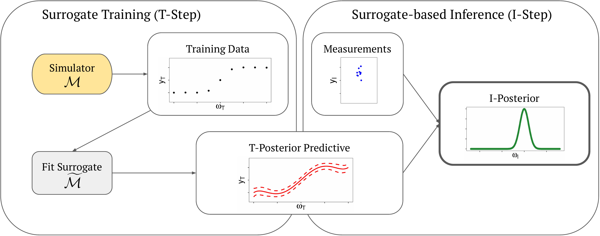

# Uncertainty Quantification and Propagation in Surrogate-based Bayesian Inference

__Authors:__ Philipp Reiser, Javier Enrique Aguilar, Anneli Guthke, Paul-Christian Bürkner

------------------------------------------------------------------------

## Overview

This repository contains code to replicate key experiments from our
paper Uncertainty Quantification and Propagation in Surrogate-based
Bayesian Inference.



------------------------------------------------------------------------


## Replicating

In this section, we will detail how to run both the baseline approach
(Point), as well as `E-Post`, `E-Lik`, and `E-Log-Lik`. We will showcase
this on the two Case studies for a linear and a logistic simulator.


### Case Study 1: Linear Model

To replicate the uncertainty propagation (UP) via analytic and numeric
integration for the linear model, use the script

```
src/eval/run_eval_two_step_linear.R
```

The results are then stored in `plots/analytic_case/linear_intercept/`.

### Case Study 2: Logistic Model

To replicate the UP via MCMC for the logistic model and plot respective
I-posteriors, use the script

``` 
src/eval/run_eval_two_step_logistic.R
```

The results are then stored in
`plots/logistic_case_densities/true_model`.

To replicate the UP via MCMC for the polynomial surrogate model (PCE)
and plot respective I-posteriors, use the script

```
src/eval/run_eval_two_step_logistic.R
```

and set

```R
config_file_name <- "pce_config.yml"
```

The results are then stored in `plots/logistic_case_densities/pce`.

To replicate the calibration results for the logistic model, use

``` 
src/eval/run_sbc_logistic.R
src/eval/eval_sbc_logistic.R
```

The results are then stored in `plots/logistic_case_sbc/`.

------------------------------------------------------------------------

## Related repositories
- [Bayesian-sparse-PCE](https://github.com/paul-buerkner/Bayesian-sparse-PCE)

- [SBC](https://github.com/hyunjimoon/SBC)

- [sbc_test_quantities_paper](https://github.com/martinmodrak/sbc_test_quantities_paper)

------------------------------------------------------------------------

## Citation

``` bibtex
@misc{reiser2023uncertainty,
      title={Uncertainty Quantification and Propagation in Surrogate-based Bayesian Inference}, 
      author={Philipp Reiser and Javier Enrique Aguilar and Anneli Guthke and Paul-Christian Bürkner},
      year={2023},
      eprint={2312.05153},
      archivePrefix={arXiv},
      primaryClass={stat.ML}
}
```
